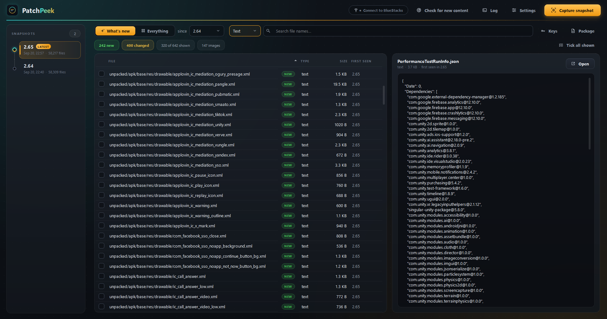
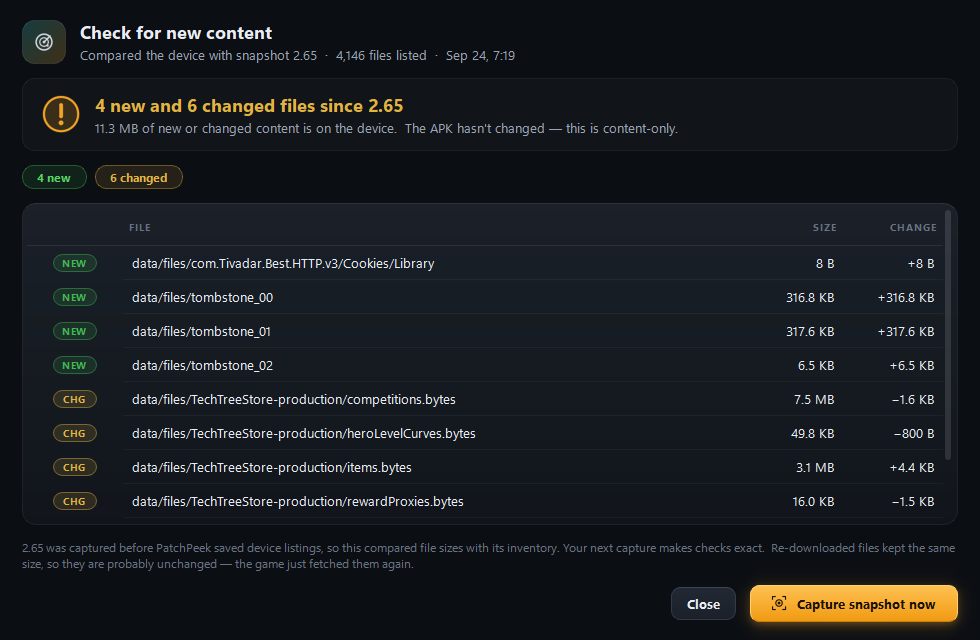
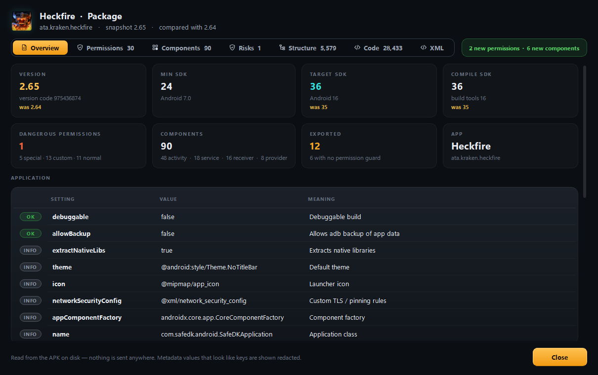
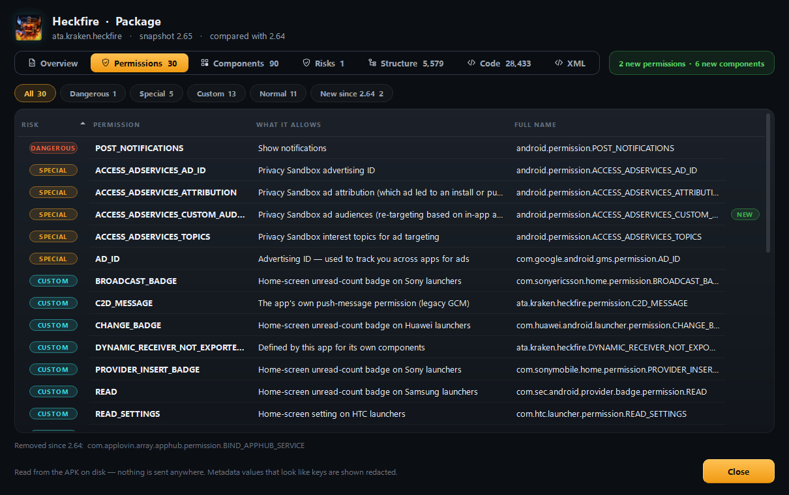
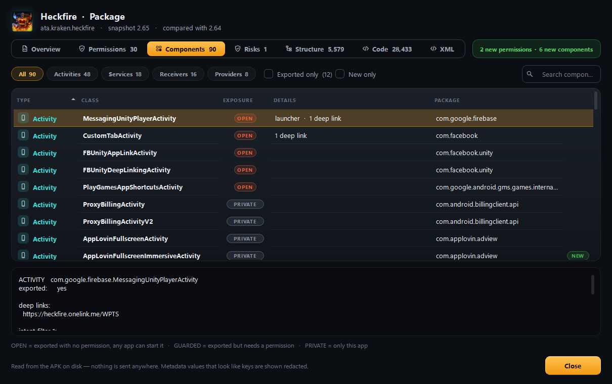
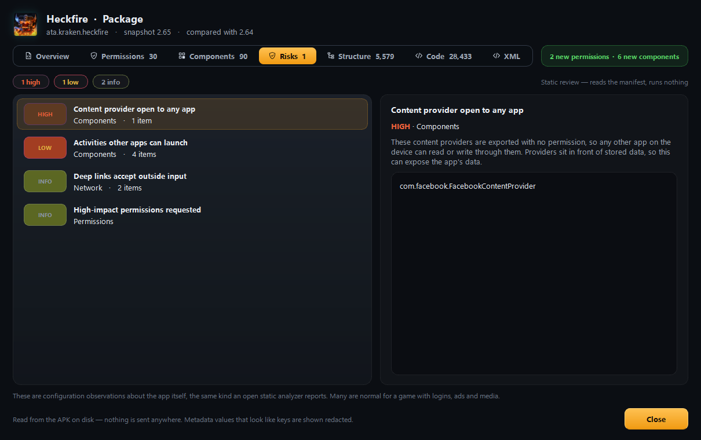
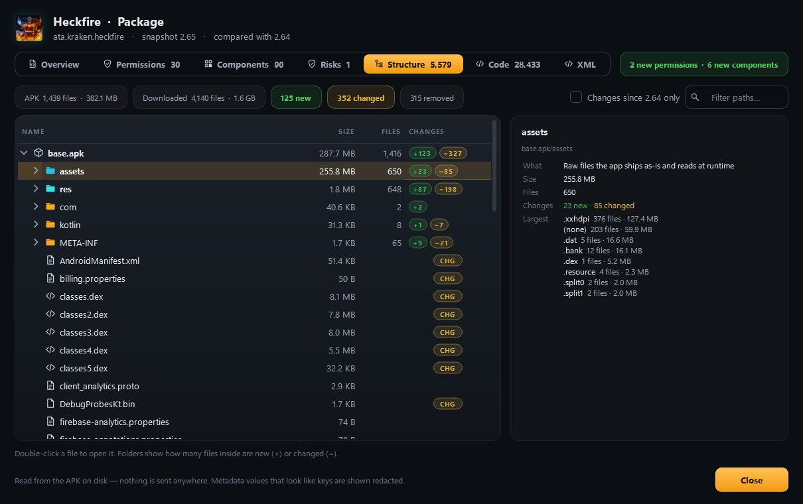
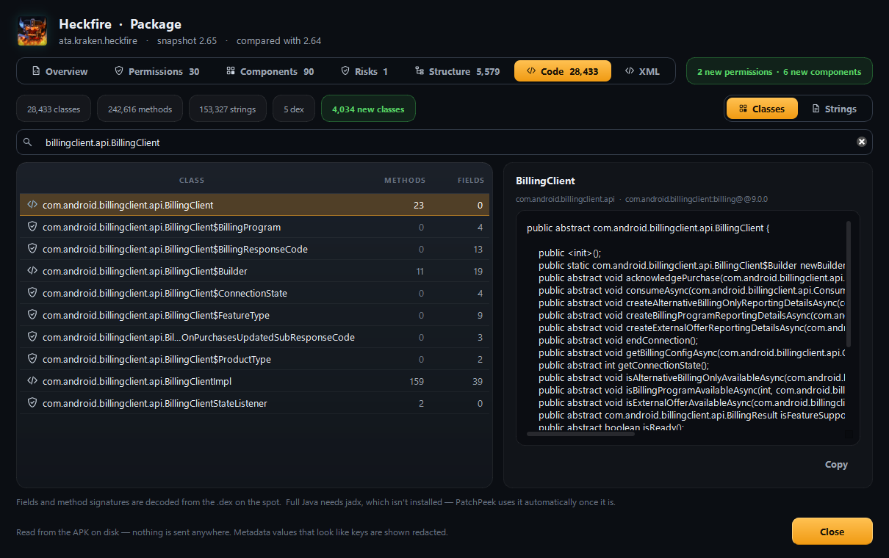

<div align="center">


# PatchPeek

**See what a mobile game's next update added — before it shows up in the game.**

Pull an Android game's files off an emulator, unpack them, and diff every
patch to find new artwork, config and content the moment it lands on your
device — often days or weeks before it goes live.


<br/>



</div>

---

## Why this exists

Live-service games ship a thin APK and stream the rest. New seasons, units,
skins and events usually land on your device **before** the switch is flipped
to show them in-game. The way to find that unreleased content is to snapshot
the game's files after every patch and compare the snapshots.

PatchPeek automates that whole loop and gives you a place to browse the
result — no adb commands, no unzipping, no hunting through folders.

> Built for [Heckfire](https://play.google.com/store/apps/details?id=ata.kraken.heckfire)
> on BlueStacks, but nothing in it is Heckfire-specific. Point it at any Unity
> Android package and it works the same way.

---

## What it does

<table>
<tr><td width="50%" valign="top">

### 📦 Capture &amp; diff
- Finds your running **BlueStacks** instance over adb
- Pulls the **APK, its splits, the OBB** and the downloaded
  content in `Android/data/<package>/files`
- Unpacks every archive and opens **Unity bundles**, exporting
  textures, sprites, TextAssets and MonoBehaviour data
- Hashes everything and stores a normalized copy of every text file
- Diffs against the previous version — **green for new, amber for
  changed** — down to the changed line

</td><td width="50%" valign="top">

### 🔎 Browse &amp; export
- A built-in viewer: **filter, search, preview**
- Images preview on a transparency checkerboard; JSON is
  prettified; audio and video open in one click
- Tick what you want and **export** it
- Every capture keeps two views — the **full asset list** and each
  **diff** — side by side, so comparing never costs you the ability
  to scroll the whole thing

</td></tr>
</table>

### 📡 Check for new content — without a capture

Publishers often push new content straight from their CDN, with **no store
update and no APK change**. **Check for new content** lists the game's files on
the device — names, sizes and timestamps only, nothing is copied — and compares
them with your last snapshot. In a few seconds you know whether anything was
downloaded in the background, exactly which files, and whether the APK itself
changed. Only capture when there's actually something to capture.

Turn on **Settings → Watch for new content** and PatchPeek re-checks every 15
minutes while it's open; the button lights up amber when something lands. Tick
**Capture a snapshot automatically when new content is found** as well and it
snapshots the drop on its own, so your snapshots stay current without you
there.

<p align="center">

</p>

### 🕓 First-seen index

A diff only shows what moved between two captures. Content that was already
sitting unreleased in **both** looks unchanged — because it is. The
**first-seen** index records which capture each asset first appeared in, so you
can sort by it and surface the backlog: an asset that showed up two patches ago
and still isn't live is the highest-signal thing in a dump.

### 🔑 Key &amp; secret scanner

Flags strings that look like API keys or credentials — Google, Firebase, AWS,
Stripe, JWTs, private keys and more — says what each one is for, and shows where
it sits.

> **Detection only.** It never validates a key or contacts any service, and it
> shows values redacted. Keys baked into a client build are extractable by
> anyone who has the app and are usually not secret — this only surfaces what
> the app already ships.

---

## Package inspector

One window decodes the APK itself, across seven tabs. Everything it needs is
saved into the snapshot, so it keeps working after raw files are cleaned up.

| Tab | What it shows |
| --- | --- |
| **Overview** | Package, version name/code, min / target / compile SDK, the app's real icon and name, risky application flags (debuggable, backup, cleartext HTTP), and every `<meta-data>` entry — with key-looking values redacted |
| **Permissions** | Every requested permission ranked **dangerous / special / custom / normal**, each with a plain-English line on what it allows, and what's new since the previous version |
| **Components** | Every activity, service, receiver and provider, whether other apps can reach it (**open / guarded / private**), deep links, provider authorities and intent filters |
| **Risks** | A read-only static review: debuggable or backup-enabled builds, cleartext HTTP, components any app can reach, weak permission guards and more — ranked by severity with a plain explanation. Reads the manifest; runs nothing |
| **Structure** | A browsable tree of the base APK and its splits (`assets/`, `res/`, `lib/` first), the OBB and the downloaded content, with folder sizes, file counts and how many files inside are new or changed |
| **Code** | A `.dex` reader: the class tree with method/field counts, each class's fields and method signatures decoded on the spot, and the searchable string pool (URLs, messages, flags). Hands off to [jadx](https://github.com/skylot/jadx) for full Java when it's installed |
| **XML** | The full decoded `AndroidManifest.xml`, highlighted, searchable and savable — with resource ids named from `resources.arsc` (`@0x7f0d0027` → `@string/app_name`) or swapped for their actual values |

<table>
<tr>
<td width="50%"><br/><sub><b>Overview</b> — versions, SDK levels, app flags, metadata</sub></td>
<td width="50%"><br/><sub><b>Permissions</b> — ranked by risk, with what's new</sub></td>
</tr>
<tr>
<td><br/><sub><b>Components</b> — who can reach what, deep links</sub></td>
<td><br/><sub><b>Risks</b> — static configuration review</sub></td>
</tr>
<tr>
<td><br/><sub><b>Structure</b> — assets/, res/, lib/ with change counts</sub></td>
<td><br/><sub><b>Code</b> — classes, signatures and strings from the .dex</sub></td>
</tr>
</table>

Everything is decoded in pure Python — the binary `AndroidManifest.xml`, the
`resources.arsc` table and the `.dex` files — so there's no apktool, jadx or
Java to install for any of it (jadx is optional, only for full decompilation).

---

## Install

**From the installer** — grab `PatchPeek-Setup.exe` from
[Releases](../../releases) and run it. Nothing else needed; Python and the
libraries are bundled.

**From source**

```bash
git clone <this repo>
cd PatchPeek
setup.bat          # installs PyQt6, UnityPy, Pillow
PatchPeek.bat      # launches the app
debug.bat          # same, but keeps a console open so errors are visible
```

Requires **Python 3.9+** with PyQt6 (the python.org installer is fine). You
also need **adb** — BlueStacks ships one called `HD-Adb.exe` and PatchPeek finds
it automatically, or install Android platform-tools.

---

## Using it

1. Start **BlueStacks** and turn on **Settings → Advanced → Android Debug Bridge**.
2. Launch the game and let it finish downloading content. PatchPeek reads
   what's on disk; it can't make the game fetch anything.
3. Press **Find BlueStacks**, then **Capture snapshot**.

The first capture has nothing to compare against, so it indexes everything as a
baseline. After the next update, capture again and the **What's new** view shows
only what changed.

Between updates, press **Check for new content** (or turn on the background
watch) to see whether the game downloaded anything since your last snapshot —
it takes seconds and copies nothing.

### Things worth knowing

- **Content changes without the version changing.** Publishers push assets to
  the CDN without shipping a new APK. Capture whenever you suspect a drop;
  captures of the same version get a timestamp suffix so nothing is overwritten.
- **Direction matters.** The *since* picker controls which way the diff runs.
  "New" means *in the newer capture but not the older one*.
- **Keep raw files** keeps the extracted assets on disk so the image viewer and
  the code decoder have something to read. It costs disk space; the inspector
  tabs still work without them from the saved index.
- **F12** saves a PNG of whichever PatchPeek window you're looking at to
  `Pictures\PatchPeek` (set `PATCHPEEK_SCREENSHOTS` to change the folder) —
  handy for sharing a find.
- A full capture takes a while — most of it is opening several thousand Unity
  bundles. The progress bar reports the phase and an ETA.

---

## Speed

Snapshotting is dominated by per-file overhead on Windows, not by hashing, so:

- normalized text goes into **one zip per snapshot** instead of tens of
  thousands of loose files
- reads and hashes run on a **thread pool** (they're latency-bound on NTFS once
  a realtime AV scanner is in the path)
- Unity bundles are opened in a **process pool** — that part is CPU-bound
- files placed in the gallery are **hardlinked**, not copied

Thread count is chosen per platform and can be overridden:

```bat
set PATCHPEEK_READ_WORKERS=16
```

Measure the best value for your machine:

```bat
python core.py --bench path\to\project\extracted\<capture>
```

Excluding your project folder from Defender's realtime scanning helps too.

---

## Building

```bat
build.bat            # dist\PatchPeek\ plus dist\PatchPeek-Setup.exe
build.bat onefile    # single portable dist\PatchPeek.exe
```

The default is a folder build on purpose: every worker process of a `--onefile`
build re-unpacks the whole archive before it can start, which is wasteful given
the process pool. The installer needs
[Inno Setup 6](https://jrsoftware.org/isdl.php); without it you still get the
folder build.

---

## Project layout

| Path | What it is |
| --- | --- |
| `core.py` | Engine: adb, extraction, snapshots, diffing, first-seen. No GUI imports |
| `patchpeek.py` | PyQt6 interface |
| `manifest.py` | Binary `AndroidManifest.xml` decoder, analysis and risk review |
| `arsc.py` | `resources.arsc` decoder (resource ids → names and values) |
| `dex.py` | DEX reader: classes, method/field signatures, strings |
| `tools/` | Asset generators (icons, splash, social preview, the Android framework name table) |
| `docs/` | README screenshots and the GitHub social preview image |
| `build.bat` / `installer.iss` | Packaging |
| `<project>/snapshots/` | Hashes, zipped text and cached indexes per capture |
| `<project>/new-assets/` | Full asset lists and per-diff galleries |
| `<project>/first-seen.json` | Which capture each asset first appeared in |
| `<project>/reports/` | Markdown diff reports |

---

## Legal

PatchPeek reads files already on your own device. It does not modify the game,
patch anything, or interact with a running client, and it never contacts the
game's servers.

Datamining almost certainly violates the game's terms of service. **Don't
redistribute extracted assets** — they belong to their publisher — and
understand that leaking unreleased content is the part publishers actually
object to. Your account, your risk.

Licensed under the [MIT License](LICENSE).
